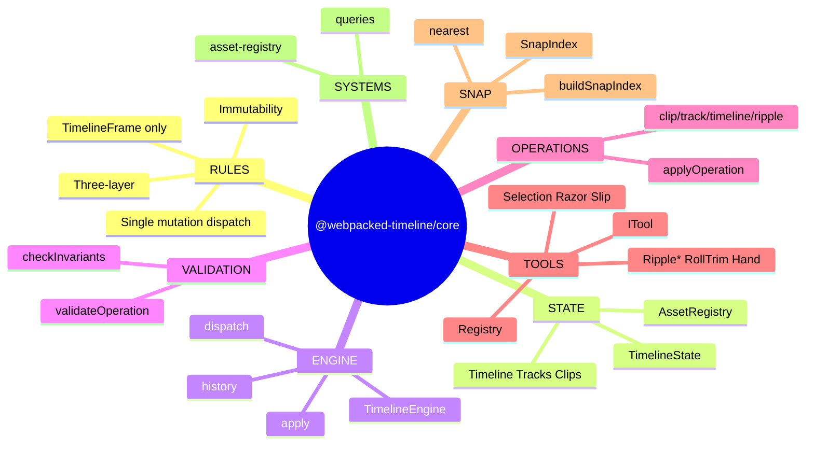
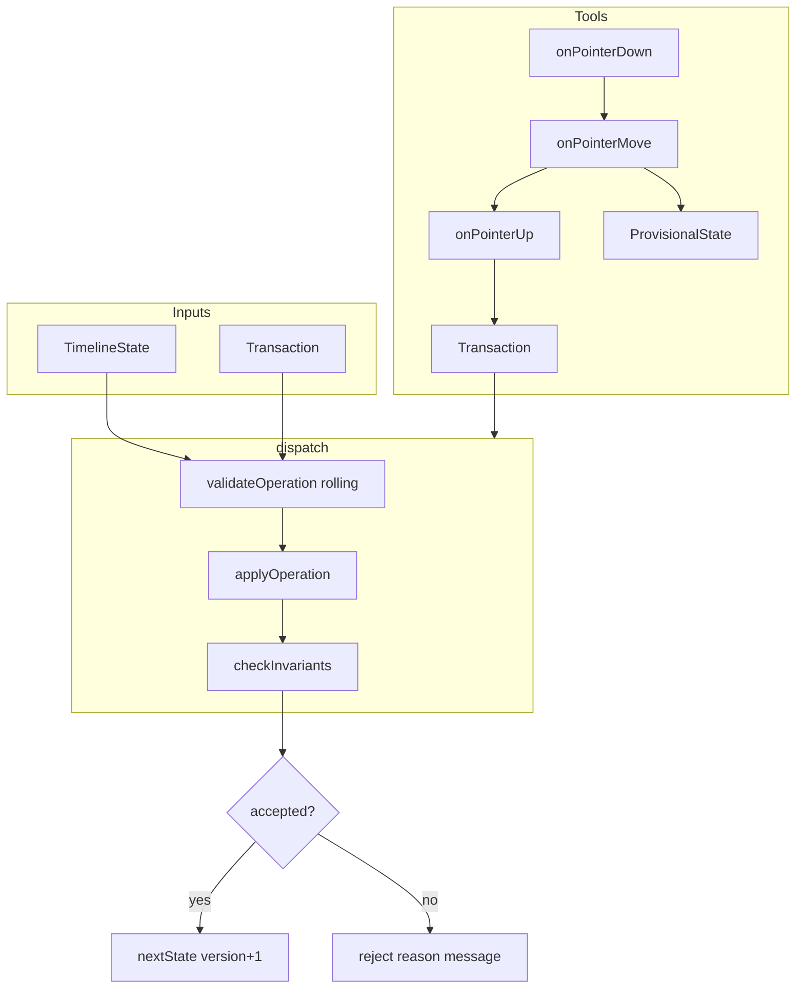
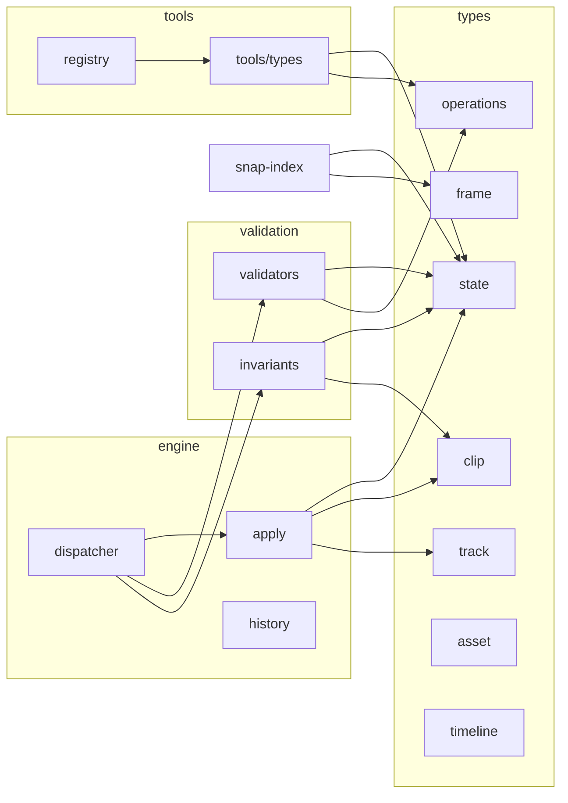

# @webpacked-timeline/core — Architecture (HLD & LLD)

High-Level Design (HLD) and Low-Level Design (LLD) for the timeline editing kernel.

---

## 1. High-Level Design (HLD)

### 1.1 Purpose

`@webpacked-timeline/core` is a **framework-agnostic**, **immutable** timeline editing kernel. It:

- Holds the single source of truth: **TimelineState** (timeline + asset registry).
- Exposes **one** mutation entry point: **dispatch(state, transaction)**.
- Provides **tools** (Selection, Razor, Slip, Ripple*, Roll Trim, Hand) that produce **Transactions** from pointer/key events.
- Supports **undo/redo** via snapshot history; **snap-to-edge** via a **SnapIndex**; and **provisional (ghost)** state during drags.

### 1.2 Architectural Principles

| Principle | Rule |
|-----------|------|
| **Three-layer law** | `core` imports only stdlib + TypeScript. No React, DOM, or UI. |
| **Single mutation entry** | Only `dispatch(state, transaction)` produces a new `TimelineState`. |
| **Strict immutability** | All state updates return new objects; no in-place mutation. |
| **Time type law** | All frame positions are `TimelineFrame` (branded integer); never raw `number`. |

### 1.3 Top-Level Components

```
┌─────────────────────────────────────────────────────────────────────────────┐
│                           @webpacked-timeline/core                                     │
├─────────────────────────────────────────────────────────────────────────────┤
│  TYPES           │  Canonical data: TimelineState, Clip, Track, Asset,       │
│                  │  OperationPrimitive, Transaction, TimelineFrame, IDs     │
├──────────────────┼──────────────────────────────────────────────────────────┤
│  ENGINE          │  dispatch() → validate → apply → invariants → nextState   │
│                  │  HistoryStack (past / present / future)                   │
│                  │  TimelineEngine (optional OOP wrapper + legacy API)        │
├──────────────────┼──────────────────────────────────────────────────────────┤
│  VALIDATION      │  Per-op validators (before apply)                          │
│                  │  checkInvariants() (after full proposed state)            │
├──────────────────┼──────────────────────────────────────────────────────────┤
│  OPERATIONS      │  apply.ts: pure applier per OperationPrimitive             │
│                  │  clip/track/timeline/ripple: compound Transaction builders│
├──────────────────┼──────────────────────────────────────────────────────────┤
│  TOOLS           │  ITool: onPointerDown/Move/Up, onKeyDown/Up, onCancel     │
│                  │  Registry, NoOpTool, ProvisionalState for ghosts         │
├──────────────────┼──────────────────────────────────────────────────────────┤
│  SNAP            │  SnapIndex (ClipStart/End, Playhead; Phase 2: Marker, etc.)│
│                  │  buildSnapIndex(), nearest(), toggleSnap()                 │
├──────────────────┼──────────────────────────────────────────────────────────┤
│  SYSTEMS         │  Queries (findClipById, getClipsAtFrame, …)               │
│                  │  Asset registry helpers; validation helpers               │
└──────────────────┴──────────────────────────────────────────────────────────┘
```

### 1.4 Data Flow (Mutation Path)

```
User / Adapter
      │
      ▼
  Transaction (id, label, operations: OperationPrimitive[])
      │
      ▼
  dispatch(state, transaction)
      │
      ├─► For each op: validateOperation(rollingState, op)  ──► reject? → return { accepted: false }
      │
      ├─► proposedState = applyOperation(proposedState, op)  (rolling state)
      │
      ├─► checkInvariants(proposedState)  ──► violations? → return { accepted: false }
      │
      └─► return { accepted: true, nextState: { ...proposedState, version+1 } }
```

History is **not** inside the dispatcher: the **caller** (e.g. TimelineEngine or React adapter) does `pushHistory(history, result.nextState)` after acceptance.

### 1.5 Tool → Transaction Flow

```
DOM events (from adapter)
      │
      ▼
  ToolRouter → frameAtX, trackAtY, clipId hit-test
      │
      ▼
  ITool.onPointerDown / onPointerMove / onPointerUp
      │
      ├─► onPointerMove → ProvisionalState | null (ghost; never dispatch)
      │
      └─► onPointerUp → Transaction | null
                           │
                           ▼
                       dispatch(state, transaction)
```

SnapIndex is built **after** an accepted dispatch (e.g. via `queueMicrotask`); tools receive a **read-only** SnapIndex in `ToolContext` and never rebuild it during a drag.

---

## 2. Low-Level Design (LLD)

### 2.1 Type System (`types/`)

| File | Responsibility |
|------|----------------|
| `state.ts` | `TimelineState`, `AssetRegistry`, `createTimelineState`, `CURRENT_SCHEMA_VERSION` |
| `timeline.ts` | `Timeline`, `SequenceSettings`, `createTimeline` |
| `track.ts` | `Track`, `TrackId`, `TrackType`, `createTrack`, `sortTrackClips` |
| `clip.ts` | `Clip`, `ClipId`, `createClip`, `getClipDuration`, `clipContainsFrame`, `clipsOverlap` |
| `asset.ts` | `Asset`, `AssetId`, `AssetStatus`, `createAsset` |
| `frame.ts` | `TimelineFrame`, `FrameRate`, `Timecode`, `RationalTime`, `toFrame`, `toTimecode`, `FrameRates` |
| `operations.ts` | `OperationPrimitive` (discriminated union), `Transaction`, `DispatchResult`, `RejectionReason`, `InvariantViolation`, `ViolationType` |

**Invariants:** All frame positions in the engine are `TimelineFrame`. `Timecode` is display-only; `RationalTime` is ingest/export only.

### 2.2 Engine (`engine/`)

| File | Responsibility |
|------|----------------|
| **dispatcher.ts** | `dispatch(state, transaction): DispatchResult`. Steps: (1) for each op validate against rolling state; (2) apply op to rolling state; (3) `checkInvariants(proposedState)`; (4) bump `timeline.version` and return `nextState`. No history, no events, no async. |
| **apply.ts** | `applyOperation(state, op): TimelineState`. Pure switch on `op.type`; no validation. Uses helpers: `updateTrack`, `updateTrackOfClip`, `updateClip`. Never mutates. |
| **history.ts** | `HistoryState = { past, present, future, limit }`. Pure: `createHistory`, `pushHistory`, `undo`, `redo`, `canUndo`, `canRedo`, `getCurrentState`, `clearHistory`. Limit eviction drops oldest from `past`. |
| **timeline-engine.ts** | Optional OOP facade: holds `HistoryState`, subscribes listeners, exposes legacy API (e.g. `addClip`, `rippleDelete`) via a **legacy shim** that calls old operation functions and pushes resulting state into history. Phase 1+ uses `dispatch` + transaction from adapter. |
| **transactions.ts** | Legacy transaction context: `beginTransaction`, `applyOperation` (state→state), `commitTransaction`, `rollbackTransaction`. Used by ripple/track/timeline operation modules that return new state; not the same as the `Transaction` type (batch of OperationPrimitives). |

### 2.3 Validation (`validation/`)

| File | Responsibility |
|------|----------------|
| **validators.ts** | `validateOperation(state, op): Rejection | null`. Per–operation-primitive checks (clip exists, track not locked, no overlap, bounds, asset in registry, etc.). Returns `{ reason, message }` or null. |
| **invariants.ts** | `checkInvariants(state): InvariantViolation[]`. Nine checks (order matters): schema version; track clips sorted; no overlap; asset missing; track type mismatch; media bounds; duration/speed; clip beyond timeline; speed > 0. No short-circuit; collect all violations. |

### 2.4 Operations (`operations/`)

| File | Responsibility |
|------|----------------|
| **clip-operations.ts** | `addClip`, `removeClip`, `moveClip`, `resizeClip`, `trimClip`, `moveClipToTrack`, `updateClip`. Each returns new `TimelineState` (used by legacy engine path and by compound builders). |
| **track-operations.ts** | `addTrack`, `removeTrack`, `moveTrack`, `setTrackHeight`, `toggleTrackMute/Lock/Solo`, etc. |
| **timeline-operations.ts** | `setTimelineDuration`, `setTimelineName`, etc. |
| **ripple.ts** | `rippleDelete`, `rippleTrim`, `insertEdit`, `rippleMove`, `insertMove`. Build sequences of internal state transforms (via legacy transaction context) and return new state. Used by TimelineEngine legacy API. |

**Compound Transaction patterns (for dispatch path):** Slice = DELETE_CLIP + INSERT_CLIP×2; Ripple Delete = DELETE_CLIP + MOVE_CLIP×N (left-to-right for −delta); Roll Trim = RESIZE_CLIP(end, A) + RESIZE_CLIP(start, B); Ripple Trim = RESIZE_CLIP + MOVE_CLIP×N; etc. MOVE_CLIP order for same-direction shifts: right-to-left for +delta, left-to-right for −delta.

### 2.5 Tools (`tools/`)

| File | Responsibility |
|------|----------------|
| **types.ts** | `ITool`, `ToolContext`, `TimelinePointerEvent`, `TimelineKeyEvent`, `ProvisionalState`, `RubberBandRegion`, `ToolId`, `Modifiers`. Contract: `onPointerMove` never dispatches; `onPointerUp` returns `Transaction | null` and does not mutate instance state after capture-before-reset. |
| **registry.ts** | `ToolRegistry`, `createRegistry`, `activateTool` (calls outgoing `onCancel()`), `getActiveTool`, `registerTool`, `NoOpTool`. |
| **provisional.ts** | `ProvisionalManager`, `createProvisionalManager`, `setProvisional`, `clearProvisional`, `resolveClip` (provisional vs committed clip resolution). |
| **selection.ts** | `SelectionTool`: pointer down/move/up, rubber-band region, produces Transaction for selection or move. |
| **razor.ts** | `RazorTool`: slice at frame → DELETE_CLIP + INSERT_CLIP×2. |
| **slip.ts** | `SlipTool`: `SET_MEDIA_BOUNDS` only. |
| **ripple-trim.ts** | `RippleTrimTool`: RESIZE_CLIP + MOVE_CLIP×N, order by delta sign. |
| **ripple-delete.ts** | `RippleDeleteTool`: DELETE_CLIP + MOVE_CLIP×N. |
| **ripple-insert.ts** | `RippleInsertTool`: MOVE_CLIP×N + INSERT_CLIP. |
| **roll-trim.ts** | `RollTrimTool`: two RESIZE_CLIPs (adjacent clip edges). |
| **hand.ts** | `HandTool`: pan/scroll callback; no Transaction. |

### 2.6 Snap Index (`snap-index.ts`)

- **SnapPoint**: `frame`, `type`, `priority`, `trackId`, `sourceId`.
- **SnapPointType**: ClipStart, ClipEnd, Playhead (Phase 1); Marker, InPoint, OutPoint (Phase 2); BeatGrid (Phase 3).
- **Priority table**: Marker 100, In/Out 90, ClipStart/End 80, Playhead 70, BeatGrid 50.
- **buildSnapIndex(state, playheadFrame, enabled?)**: Collect clip boundaries and playhead; sort by frame. Called after accepted dispatch (e.g. queueMicrotask); never during drag.
- **nearest(index, frame, radiusFrames, exclude?, allowedTypes?)**: Best snap within radius; tiebreak by priority then order.
- **toggleSnap(index, enabled)**: Returns new index with `enabled` toggled.

### 2.7 Systems (`systems/`)

| File | Responsibility |
|------|----------------|
| **queries.ts** | Read-only: `findClipById`, `findTrackById`, `getClipsOnTrack`, `getClipsAtFrame`, `getClipsInRange`, `getAllClips`, `getAllTracks`, `findTrackIndex`. |
| **asset-registry.ts** | `registerAsset`, `getAsset`, `hasAsset`, `getAllAssets`, `unregisterAsset` (state→state helpers; actual mutation goes through REGISTER_ASSET / UNREGISTER_ASSET in dispatch). |
| **validation.ts** | `validateClip`, `validateTrack`, `validateTimeline`, `validateNoOverlap`, `validateTrackTypeMatch` (higher-level validation; invariants are the authority post-apply). |

### 2.8 Utilities (`utils/`)

- **frame.ts**: `framesToSeconds`, `secondsToFrames`, `framesToTimecode`, `clampFrame`, `addFrames`, `subtractFrames`, `frameDuration`.
- **id.ts** / **id-phase2.ts**: `generateClipId`, `generateTrackId`, `generateAssetId`, etc.; Phase 2: `generateMarkerId`, `generateGroupId`, `generateLinkGroupId`.

### 2.9 Public API (`public-api.ts` / `index.ts`)

Exports: factories (createTimeline, createTrack, createClip, createAsset, createTimelineState); frame utils; **TimelineEngine**; **dispatch**; **checkInvariants**; history functions and HistoryState; all public types (state, operations, frame, IDs, entities); snap index (buildSnapIndex, nearest, toggleSnap, types); tool types and registry (ITool, ToolContext, createRegistry, activateTool, NoOpTool, etc.); provisional manager. Internal modules (e.g. apply, validators) are not exported.

---

## 3. Mind Map (Text + Mermaid)

### 3.1 Text Mind Map

```
@webpacked-timeline/core
├── RULES
│   ├── Three-layer (core → no React/DOM)
│   ├── Single mutation: dispatch(state, transaction)
│   ├── Immutability (no .push/.splice; spread/map/filter)
│   └── Time type (TimelineFrame only; no raw number)
│
├── STATE
│   ├── TimelineState
│   │   ├── schemaVersion
│   │   ├── timeline (Timeline)
│   │   │   ├── id, name, fps, duration, startTimecode, version
│   │   │   ├── tracks: Track[]
│   │   │   └── sequenceSettings
│   │   └── assetRegistry: Map<AssetId, Asset>
│   ├── Track (id, name, type, clips[], locked, muted, solo, height)
│   ├── Clip (id, assetId, trackId, timelineStart/End, mediaIn/Out, speed, enabled, …)
│   └── Asset (id, name, mediaType, intrinsicDuration, nativeFps, …)
│
├── MUTATION PATH
│   ├── Transaction (id, label, timestamp, operations: OperationPrimitive[])
│   ├── OperationPrimitive
│   │   ├── Clip: MOVE_CLIP, RESIZE_CLIP, SLICE_CLIP, DELETE_CLIP, INSERT_CLIP, SET_MEDIA_BOUNDS, SET_CLIP_*
│   │   ├── Track: ADD_TRACK, DELETE_TRACK, REORDER_TRACK, SET_TRACK_*
│   │   ├── Asset: REGISTER_ASSET, UNREGISTER_ASSET, SET_ASSET_STATUS
│   │   └── Timeline: RENAME_TIMELINE, SET_TIMELINE_DURATION, SET_TIMELINE_START_TC, SET_SEQUENCE_SETTINGS
│   └── dispatch()
│       ├── validateOperation(rollingState, op) per op
│       ├── applyOperation(rollingState, op) per op
│       ├── checkInvariants(proposedState)
│       └── return { accepted, nextState } (version bump once)
│
├── ENGINE
│   ├── dispatcher (dispatch)
│   ├── apply (applyOperation)
│   ├── history (createHistory, pushHistory, undo, redo, getCurrentState)
│   ├── timeline-engine (class: getState, subscribe, notify, legacy addClip/removeClip/…)
│   └── transactions (legacy: beginTransaction, applyOperation, commitTransaction)
│
├── VALIDATION
│   ├── validators (validateOperation → Rejection | null)
│   └── invariants (checkInvariants → InvariantViolation[])
│       ├── SCHEMA_VERSION_MISMATCH
│       ├── TRACK_NOT_SORTED, OVERLAP
│       ├── ASSET_MISSING, TRACK_TYPE_MISMATCH
│       ├── MEDIA_BOUNDS_INVALID, DURATION_MISMATCH
│       ├── CLIP_BEYOND_TIMELINE
│       └── SPEED_INVALID
│
├── OPERATIONS (state→state helpers)
│   ├── clip-operations (addClip, removeClip, moveClip, resizeClip, trimClip, …)
│   ├── track-operations (addTrack, removeTrack, moveTrack, toggle*)
│   ├── timeline-operations (setTimelineDuration, setTimelineName)
│   └── ripple (rippleDelete, rippleTrim, insertEdit, rippleMove, insertMove)
│
├── TOOLS
│   ├── ITool (onPointerDown, onPointerMove→ProvisionalState, onPointerUp→Transaction, onKeyDown/Up, onCancel)
│   ├── ToolContext (state, snapIndex, pixelsPerFrame, frameAtX, trackAtY, snap)
│   ├── registry (createRegistry, activateTool, getActiveTool, NoOpTool)
│   ├── provisional (ProvisionalManager, resolveClip)
│   └── implementations
│       ├── SelectionTool, RazorTool, SlipTool
│       ├── RippleTrimTool, RippleDeleteTool, RippleInsertTool
│       ├── RollTrimTool, HandTool
│       └── NoOpTool
│
├── SNAP
│   ├── SnapIndex (points[], builtAt, enabled)
│   ├── SnapPoint (frame, type, priority, trackId, sourceId)
│   ├── buildSnapIndex(state, playheadFrame) — after dispatch, not during drag
│   ├── nearest(index, frame, radiusFrames, exclude?, allowedTypes?)
│   └── toggleSnap(index, enabled)
│
├── SYSTEMS
│   ├── queries (findClipById, findTrackById, getClipsOnTrack, getClipsAtFrame, …)
│   ├── asset-registry (registerAsset, getAsset, hasAsset, …)
│   └── validation (validateClip, validateTrack, validateTimeline, …)
│
└── TYPES / UTILS
    ├── frame (TimelineFrame, FrameRate, toFrame, toTimecode)
    ├── ids (AssetId, ClipId, TrackId, ToolId)
    ├── utils/frame (framesToTimecode, secondsToFrames, clampFrame)
    └── utils/id (generateClipId, generateTrackId, …)
```

### 3.2 Mermaid Mind Map (C4-style component + flow)



### 3.3 Mermaid: Dispatch and Tool Flow



### 3.4 Mermaid: Module Dependency (Conceptual)



---

## 4. References

- **ARCHITECTURE.md** — Hard rules (three-layer, single mutation, immutability, time types).
- **DISPATCHER.md** — Exact dispatch algorithm and MOVE_CLIP ordering.
- **TYPES.md** — Canonical type definitions.
- **OPERATIONS.md** — Primitive semantics, validators, compound patterns.
- **INVARIANTS.md** — Nine invariant rules and order.
- **HISTORY.md** — HistoryStack and pure functions.
- **ITOOL_CONTRACT.md** — ITool contract, ToolContext, capture-before-reset.
- **SNAP_INDEX.md** — buildSnapIndex, nearest, rebuild rule.
