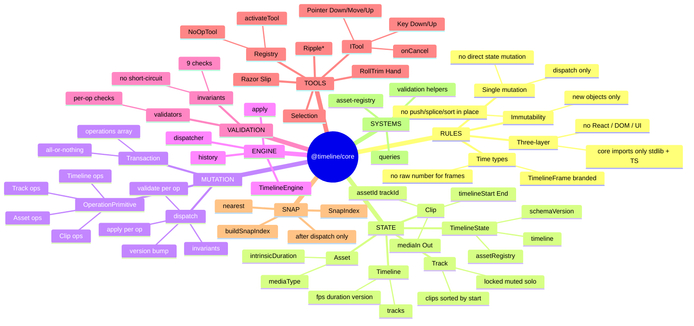
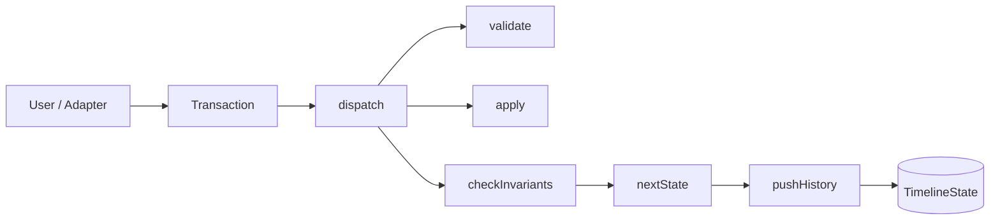
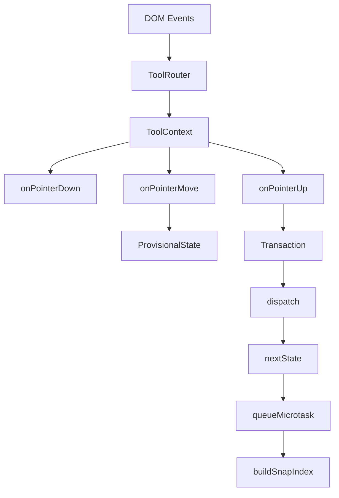
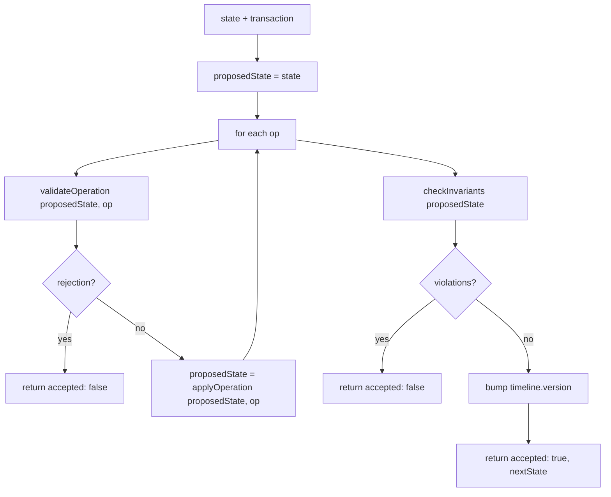
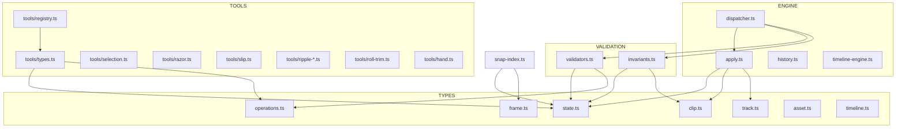
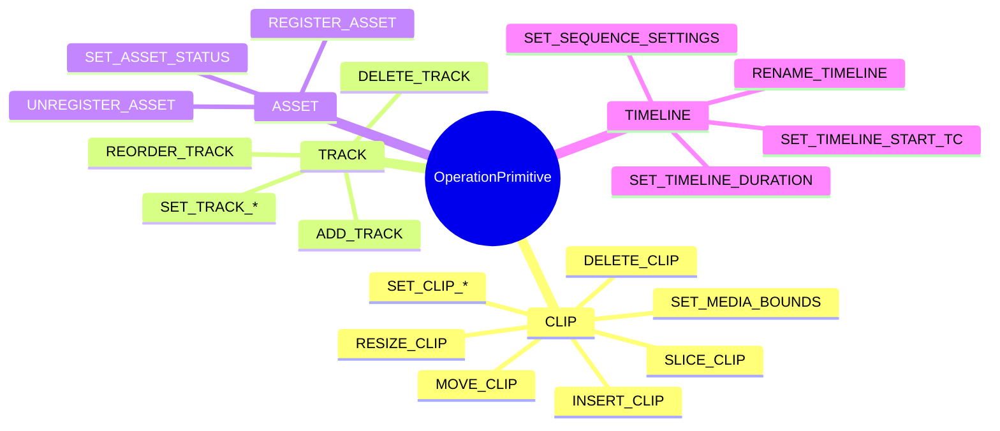
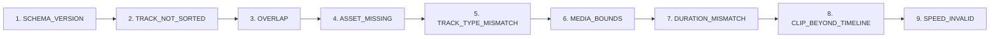

# @timeline/core — Architecture Mind Map

Standalone mind map and flow diagrams. View in any Mermaid-compatible viewer (GitHub, VS Code Mermaid extension, etc.).

---

## 1. Core Mind Map (Hierarchy)

---

## 2. Data Flow: User → State

---

## 3. Tool Event → Transaction

---

## 4. Dispatch Algorithm (Steps)

---

## 5. Module Ownership (Conceptual)

---

## 6. Operation Primitive Categories

---

## 7. Invariant Checks (Order)

